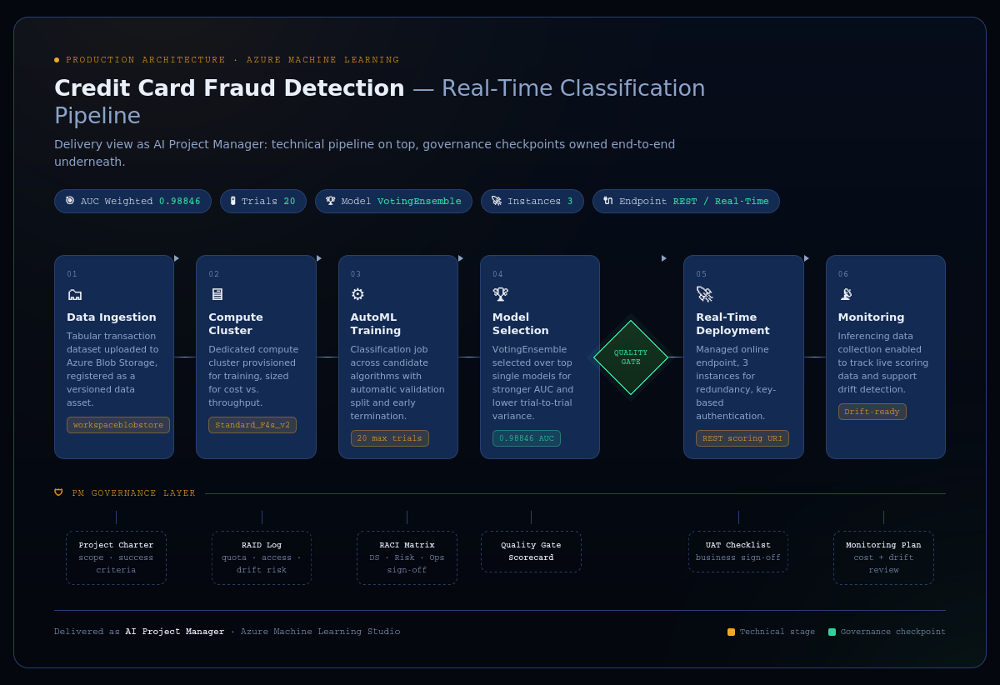

# 🛡️ Credit Card Fraud Detection — Azure Machine Learning

**Real-time transaction classification pipeline, delivered with full PM governance.**

[](https://azure.microsoft.com/en-us/products/machine-learning)
[](docs/03_RACI_Matrix.md)
[](#results)
[](docs/)

---

## 📌 Overview

An end-to-end classification pipeline that scores credit card transactions as fraudulent or legitimate in real time, built and deployed on **Azure Machine Learning Studio**. This repo documents the project the way it would be delivered in a production environment — the AutoML run *and* the project management artifacts that would sit around it in a real financial-services delivery: a charter, a RAID log, a RACI matrix, a quality gate, and a UAT sign-off.

The lab exercise this build is based on comes from **K21Academy** (instructor: Atul Kumar). Everything beyond the guided steps — the governance documentation, the architecture diagram, the write-up, and the actual run results below — is my own work as delivery owner.

## 🖼️ Architecture



Technical pipeline on top, PM governance layer underneath — the two are meant to be read together. Full interactive source: [`architecture/fraud_detection_architecture.html`](architecture/fraud_detection_architecture.html) *(if included in this repo)*.

## ⚙️ What Was Built

| Stage | Detail |
|---|---|
| **Workspace** | `Credit-Fraud-Detection` — Azure Machine Learning workspace, West US |
| **Data Asset** | `Creditcard` (v1) — tabular MLTable, registered from local upload to `workspaceblobstore` |
| **Compute** | `Fraud-Detection` compute instance (development) + dedicated compute cluster (training) |
| **Experiment** | `FraudDetection` → job `detectfraud`, task type: Classification |
| **AutoML Run** | Multiple candidate algorithms evaluated with automatic validation split |
| **Best Model** | `StandardScalerWrapper, SVM` — **0.98584 weighted AUC** |
| **Deployment** | Managed real-time online endpoint: `credit-fraud-detection-mbydj` |
| **Validation** | Live REST scoring tested from JupyterLab against a legitimate transaction (`0`) and a fraudulent transaction (`1`) |

> **Metric choice:** weighted AUC was used instead of raw accuracy because the dataset is heavily imbalanced (fraud is a small minority class) — accuracy alone would reward a model that just predicts "not fraud" every time.

## 📊 Results

- **4 candidate model families** evaluated by AutoML in this run (SVM, Voting Ensemble, Random Forest, and additional trials)
- **Best model:** StandardScalerWrapper + SVM, **0.98584** weighted AUC — selected and promoted through the quality gate
- **Deployed** to a managed real-time endpoint and validated against both known-legitimate and known-fraudulent sample transactions before sign-off

See [`docs/04_Quality_Gate_Scorecard.md`](docs/04_Quality_Gate_Scorecard.md) for the full pass/fail criteria this model was measured against.

## 🗂️ Repo Structure

```
fraud-detection-azure-ml/
├── README.md                          ← you are here
├── docs/                              ← PM governance artifacts
│   ├── 01_Project_Charter.md
│   ├── 02_RAID_Log.md
│   ├── 03_RACI_Matrix.md
│   ├── 04_Quality_Gate_Scorecard.md
│   └── 05_UAT_Checklist.md
├── architecture/
│   └── fraud_detection_architecture.png
├── notebooks/
│   └── endpoint_test.ipynb            ← live endpoint validation
├── screenshots/                       ← numbered, chronological build evidence
└── data/
    └── creditcard_sample.csv          ← anonymized (PCA V1–V28) sample used for this build
```

## 🧭 Why This Repo Looks Different From a Typical AutoML Demo

Most portfolio projects show the model. This one shows the **delivery** — because that's the job I'm building toward. Every technical decision in this repo (metric choice, model promotion, deployment configuration) has a corresponding governance artifact showing who would sign off on it and why, the way it would actually work inside a bank, fintech, or insurer's model risk framework.

## 🙋 About This Build

Delivered by **Jaswant Singh**, AI Project Manager (PMP, AWS Certified AI Practitioner) — [LinkedIn](https://www.linkedin.com/in/jaswant-singh-pmp/) · [GitHub](https://github.com/JaswantOnGit)

Lab source: K21Academy — *Credit Card Fraud Detection Using Azure Machine Learning Studio* (instructor: Atul Kumar). Governance artifacts, architecture diagram, and this write-up are original.
